# Access To — Admin System Architecture

This document describes how the Access To ecosystem is organized, automated, and monitored from the hub repository.

## System Overview

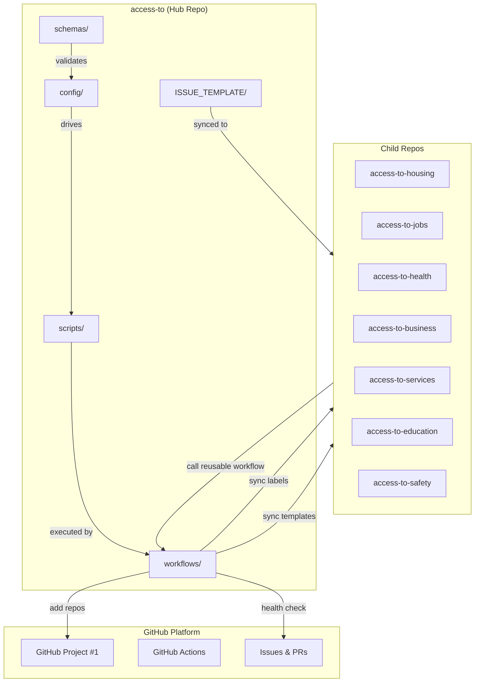

## Data Flow: Sync Lifecycle

Every sync operation follows the same pattern: config drives scripts, workflows orchestrate, and summaries report results.

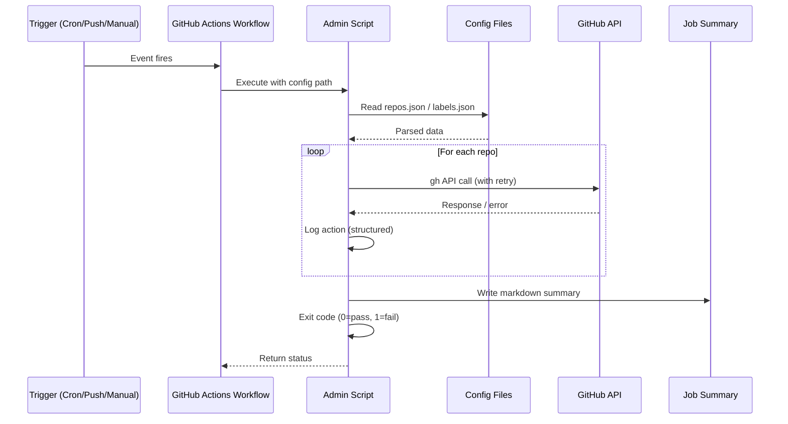

## Config Validation Pipeline

Config changes are validated before they can affect the ecosystem.

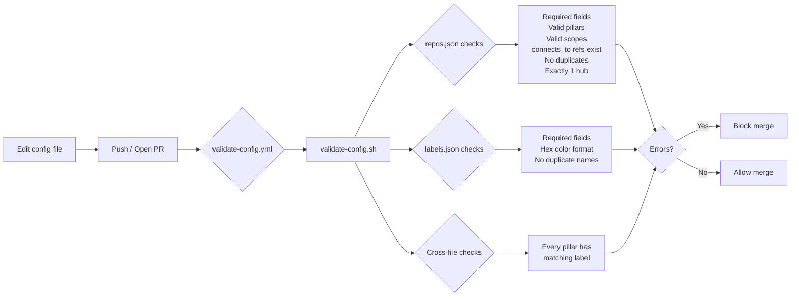

## Repo Onboarding Flow

When a new repository joins the ecosystem:

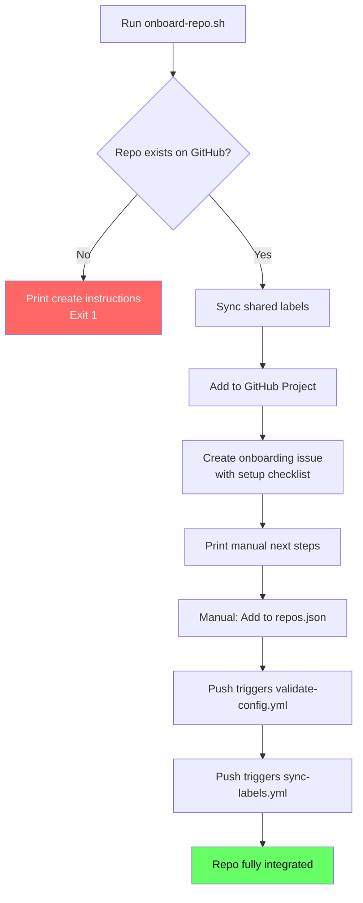

## Label Taxonomy

Labels follow a namespace convention for consistent triage across all repos:

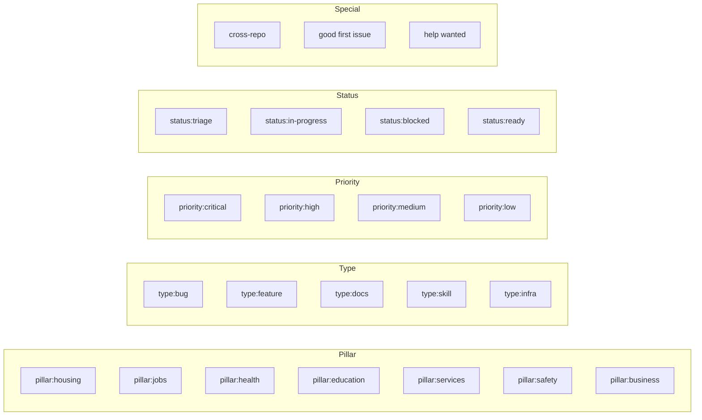

## Cross-Repo Connection Map

Pillar repos are independent but complementary. Connections represent shared user flows and data dependencies.

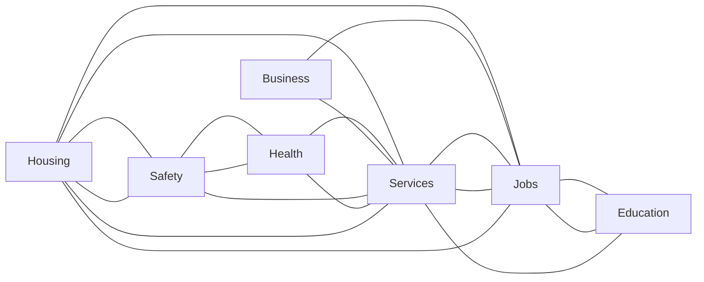

## File Structure

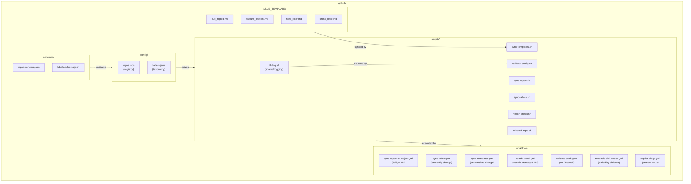

## Workflow Schedule

| Workflow | Trigger | Schedule | What it does |
|:---------|:--------|:---------|:-------------|
| sync-repos-to-project | Cron / Manual | Daily 9 AM UTC | Adds repos to GitHub Project #1 |
| sync-labels | Push / Manual | On `labels.json` change | Pushes label taxonomy to all repos |
| sync-templates | Push / Manual | On template change | Pushes issue templates to child repos |
| health-check | Cron / Manual | Monday 8 AM UTC | Dashboard: issues, PRs, staleness, connections |
| validate-config | PR / Push / Manual | On config/schema change | Validates repos.json and labels.json |
| reusable-skill-check | Called by children | On child repo events | Validates SKILL.md structure |
| copilot-triage | Issue opened | On new issue | Auto-labels by pillar/type keywords |

## AI Tooling Integration

The ecosystem uses two AI systems — Claude for end users, and Copilot + Claude Code for developers.

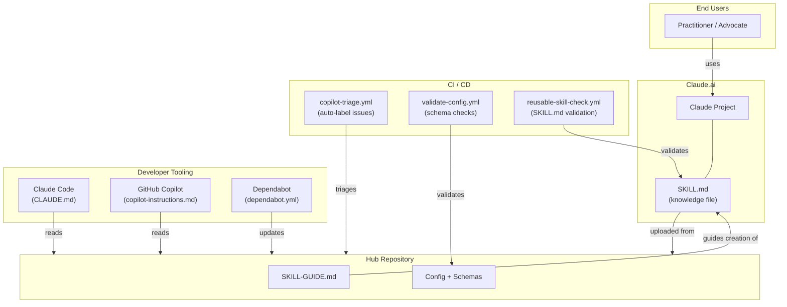

### How each AI tool contributes

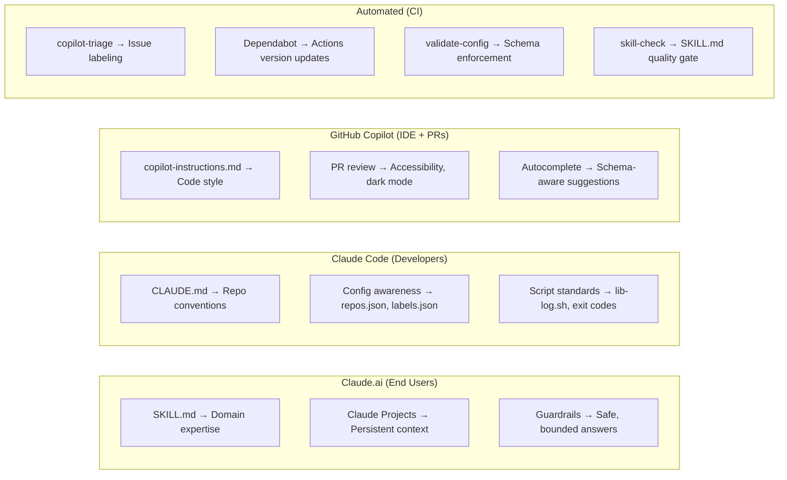

## Logging Protocol

All scripts use `lib-log.sh` for structured logging:

```
# Text mode (default):
[2026-04-06T09:00:00Z] [INFO] sync-labels: Starting sync-labels (run: 20260406090000-12345)
[2026-04-06T09:00:01Z] [ACTION] sync-labels: sync-label pillar:housing -> success (created)
[2026-04-06T09:00:05Z] [SUMMARY] sync-labels: Done in 5s | actions=28 warnings=0 errors=0

# JSON mode (LOG_FORMAT=json):
{"ts":"2026-04-06T09:00:01Z","level":"info","script":"sync-labels","run":"20260406090000-12345","msg":"sync-label pillar:housing: success","action":"sync-label","target":"pillar:housing","status":"success"}
```

Set `AUDIT_LOG=/path/to/file.jsonl` to persist an append-only audit trail of all sync operations.

## Content Backbone

The hub's config files serve as the master data source for ALL content across formats — slides, videos, podcasts, infographics, Character AI personas, and social media.

### Data Flow: Config to Content

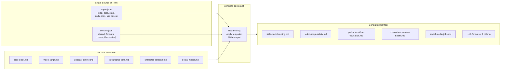

### Content Format Matrix

| Format | Per Pillar | Purpose | Audience |
|:-------|:----------|:--------|:---------|
| Slide Deck | 7 decks | Conferences, pitches, workshops | Funders, partners |
| Video Script | 7 scripts | 2-3 min explainer per pillar | General public |
| Podcast Outline | 7 episodes | 20-30 min deep dives | Practitioners, civic tech |
| Infographic Data | 7 sheets | Visual data for designers | Social media, print |
| Character Persona | 7 personas | Character AI definitions | Interactive demo users |
| Social Media | 7 copy sets | Twitter, LinkedIn, Instagram | Social followers |

### Cross-Pillar Story Arcs

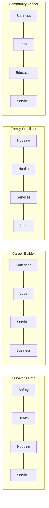

Each story represents a real user journey that spans multiple pillars. Content generators use these stories to create cohesive narratives across formats.

### Content File Structure

```
.github/content/
├── templates/
│   ├── slide-deck.md
│   ├── video-script.md
│   ├── podcast-outline.md
│   ├── infographic-data.md
│   ├── character-persona.md
│   └── social-media.md
└── generated/
    ├── slide-deck-housing.md
    ├── slide-deck-jobs.md
    ├── video-script-safety.md
    ├── podcast-outline-education.md
    ├── character-persona-health.md
    ├── social-media-services.md
    └── ... (42 files total: 6 formats x 7 pillars)
```
