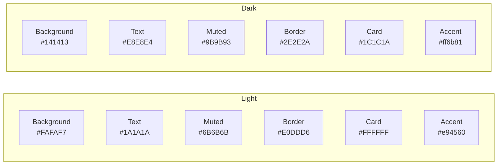
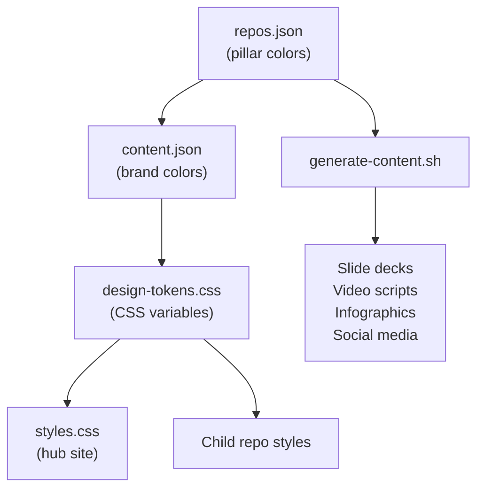

# Access To — Brand & Design Guide

The visual identity for the Access To ecosystem. All child repos, content, and tools should follow these guidelines.

## Design Tokens

Use `design-tokens.css` for consistent styling across all repos:

```html
<link rel="stylesheet" href="https://dougdevitre.org/design-tokens.css">
```

All tokens are prefixed with `--at-` to avoid conflicts with repo-specific styles.

## Color Palette

### Base Colors



### Pillar Colors

Each pillar has a light mode and dark mode variant:

| Pillar | Light | Dark | CSS Variable |
|:-------|:------|:-----|:-------------|
| Housing | `#2D7A9B` | `#5AAAC8` | `--at-color-housing` |
| Jobs | `#7A6F5B` | `#A89F8B` | `--at-color-jobs` |
| Health | `#D4585B` | `#E88A8C` | `--at-color-health` |
| Business | `#006b75` | `#33A8A8` | `--at-color-business` |
| Services | `#6B5B8A` | `#A07CC4` | `--at-color-services` |
| Education | `#4A7C59` | `#7AAF82` | `--at-color-education` |
| Safety | `#B85C38` | `#D4845A` | `--at-color-safety` |

Use pillar colors for:
- Card accent bars (top border)
- Section highlights
- Icon tints
- Chart/data visualization

Do NOT use pillar colors for body text or large background fills.

## Typography

| Role | Font | Weight | CSS Variable |
|:-----|:-----|:-------|:-------------|
| Headings | DM Serif Display | 400 | `--at-font-display` |
| Body | DM Sans | 400, 500, 700 | `--at-font-body` |
| Code | SFMono-Regular | 400 | `--at-font-mono` |

Load fonts with preconnect for performance:

```html
<link rel="preconnect" href="https://fonts.googleapis.com">
<link rel="preconnect" href="https://fonts.gstatic.com" crossorigin>
<link href="https://fonts.googleapis.com/css2?family=DM+Sans:ital,wght@0,400;0,500;0,700;1,400&family=DM+Serif+Display&display=swap" rel="stylesheet">
```

## Components

### Cards

```html
<div class="at-card">
  <h3>Card Title</h3>
  <p>Card content</p>
</div>
```

- White background, 1px border, 10px radius
- Hover: lift 3px with medium shadow
- Use for project cards, feature blocks, testimonials

### Buttons

```html
<a class="at-btn at-btn-primary" href="#">Primary Action</a>
<a class="at-btn at-btn-secondary" href="#">Secondary Action</a>
```

- Primary: dark bg, light text (inverts in dark mode)
- Secondary: transparent with border
- Hover: subtle lift + color shift

### Tags

```html
<span class="at-tag">Claude Skill</span>
<span class="at-tag">Nationwide</span>
```

- Uppercase, small text, pill-shaped border
- Use for metadata: scope, type, setup time

### Grid

```html
<div class="at-grid at-grid-2">...</div>  <!-- 2-column responsive -->
<div class="at-grid at-grid-3">...</div>  <!-- 3-column responsive -->
```

- Auto-fits to 1 column below 700px
- 2rem gap between items

## Dark Mode

Implement via `data-theme` attribute on `<html>`:

```javascript
const theme = localStorage.getItem('theme') ||
  (window.matchMedia('(prefers-color-scheme: dark)').matches ? 'dark' : 'light');
document.documentElement.setAttribute('data-theme', theme);
```

All `--at-` variables automatically adjust. No extra CSS needed in child repos.

## Spacing Scale

| Token | Value | Use |
|:------|:------|:----|
| `--at-spacing-xs` | 0.25rem | Tight gaps, inline elements |
| `--at-spacing-sm` | 0.5rem | Button padding, tag gaps |
| `--at-spacing-md` | 1rem | Card padding, section gaps |
| `--at-spacing-lg` | 2rem | Section spacing, grid gaps |
| `--at-spacing-xl` | 4rem | Major section breaks |

## Accessibility Requirements

All Access To repos must:
- Include a skip link (`.at-skip-link`)
- Use `focus-visible` outlines (included in design-tokens.css)
- Support `prefers-reduced-motion` (included in design-tokens.css)
- Use semantic HTML (`<main>`, `<nav>`, `<section>`)
- Add ARIA labels to interactive elements
- Maintain 4.5:1 contrast ratio for text

## Responsive Breakpoints

| Breakpoint | Layout change |
|:-----------|:-------------|
| `700px` | Grid collapses to 1 column |
| `600px` | Mobile menu activates |
| `500px` | Reduced padding, stacked forms |

## File Structure for Child Repos

```
your-repo/
├── index.html        # Link to design-tokens.css
├── styles.css        # Repo-specific styles (extend, don't override)
├── SKILL.md          # Claude Skill content
└── .github/
    └── workflows/
        └── validate-skill.yml
```

## Where Colors Are Defined

Single source of truth flows from config to all outputs:



Change a color in `repos.json` → update `content.json` → update `design-tokens.css` → all downstream content and styling follows.
