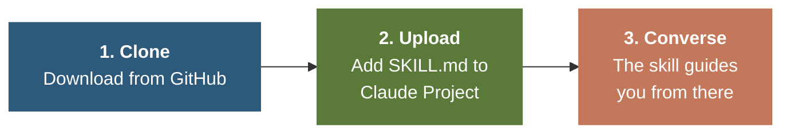
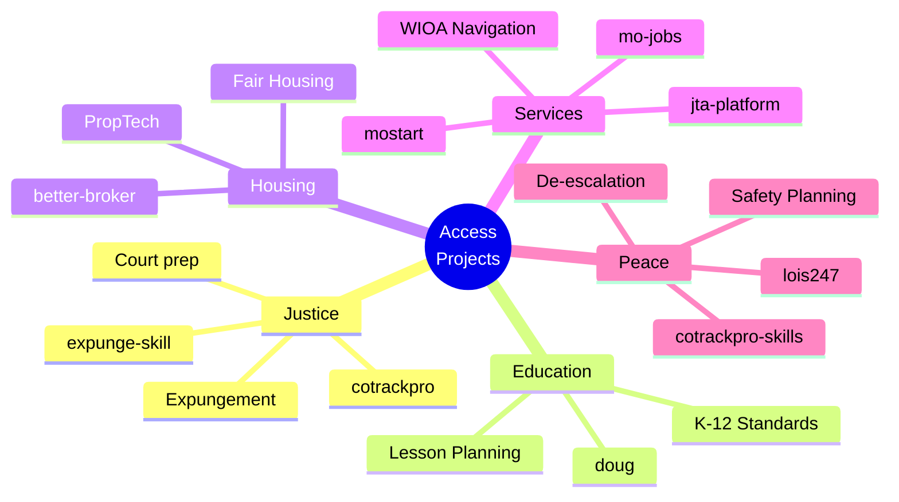
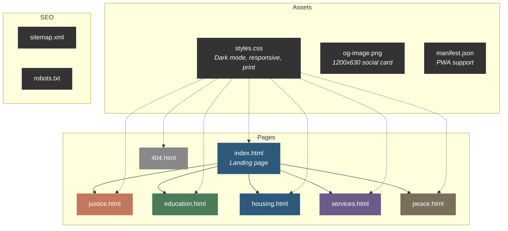

<div align="center">

<!-- HERO BANNER -->
<picture>
  <source media="(prefers-color-scheme: dark)" srcset="https://capsule-render.vercel.app/api?type=waving&color=0:1A1A1A,50:2D5A7B,100:5B7A3A&height=220&section=header&text=Access%20Projects&fontSize=48&fontColor=FAFAF7&fontAlignY=36&desc=Open-source%20AI%20tools%20closing%20the%20access%20gaps%20that%20matter%20most&descSize=16&descAlignY=56&descColor=CCCCCC&animation=fadeIn">
  
</picture>

[](https://opensource.org/licenses/MIT)
[](https://dougdevitre.github.io/access-projects/)
[](https://dougdevitre.github.io/access-projects/#pillars)
[](https://dougdevitre.github.io/access-projects/#pillars)

**A growing collection of open-source projects organized around five pillars of human access — built for practitioners, advocates, and the people they serve.**

[**View the Live Site**](https://dougdevitre.github.io/access-projects/) | [**Browse Projects**](https://dougdevitre.github.io/access-projects/#pillars) | [**How It Works**](https://dougdevitre.github.io/access-projects/#how-it-works)

</div>

---

## The Five Pillars

<table>
<tr>
<td align="center" width="20%">
<br>
<strong>Justice</strong><br>
<sub>Court prep, co-parenting<br>docs, expungement</sub><br><br>
<a href="https://github.com/dougdevitre/cotrackpro"></a><br>
<a href="https://github.com/dougdevitre/expunge-skill"></a>
</td>
<td align="center" width="20%">
<br>
<strong>Education</strong><br>
<sub>K-12 standards, lesson<br>planning, teacher growth</sub><br><br>
<a href="https://github.com/dougdevitre/doug"></a>
</td>
<td align="center" width="20%">
<br>
<strong>Housing</strong><br>
<sub>PropTech intelligence,<br>Fair Housing-safe</sub><br><br>
<a href="https://github.com/dougdevitre/better-broker"></a>
</td>
<td align="center" width="20%">
<br>
<strong>Services</strong><br>
<sub>Workforce dev, WIOA,<br>startups</sub><br><br>
<a href="https://github.com/dougdevitre/mo-jobs"></a><br>
<a href="https://github.com/dougdevitre/mostart"></a><br>
<a href="https://github.com/dougdevitre/jta-platform"></a>
</td>
<td align="center" width="20%">
<br>
<strong>Peace</strong><br>
<sub>De-escalation, safety<br>planning</sub><br><br>
<a href="https://github.com/dougdevitre/cotrackpro-skills"></a><br>
<a href="https://github.com/dougdevitre/lois247"></a>
</td>
</tr>
</table>

---

## How It Works

These projects are **Claude Skills** — structured AI prompt systems that run inside [Claude.ai](https://claude.ai). No coding required.



```bash
# 1. Clone any project
git clone https://github.com/dougdevitre/expunge-skill.git

# 2. Open Claude.ai -> Create a Project -> Upload SKILL.md as project knowledge

# 3. Start a conversation — the skill guides you from there
```

Each skill's `SKILL.md` file teaches Claude a specialized workflow — from generating court-ready documents to navigating workforce programs across all 114 Missouri counties.

---

## Impact at a Glance



<div align="center">

| | | | |
|:---:|:---:|:---:|:---:|
| **5** | **9** | **400+** | **114** |
| Pillars | Projects | Modules | MO Counties Served |

</div>

---

## Site Architecture



### Tech Stack

| Layer | Technology |
|:------|:-----------|
| **Markup** | Semantic HTML5 |
| **Styling** | Vanilla CSS (variables, Grid, Flexbox) |
| **Interactivity** | Vanilla JavaScript (no dependencies) |
| **Fonts** | [DM Serif Display](https://fonts.google.com/specimen/DM+Serif+Display) + [DM Sans](https://fonts.google.com/specimen/DM+Sans) |
| **Badges** | [Shields.io](https://shields.io) |
| **Hosting** | [GitHub Pages](https://pages.github.com) |
| **SEO** | OpenGraph, Twitter Cards, JSON-LD, XML sitemap |

### Features

<table>
<tr>
<td>

**Dark Mode** — system preference detection + manual toggle with localStorage persistence

</td>
<td>

**Responsive** — mobile-first with breakpoints at 500px, 600px, and 700px

</td>
</tr>
<tr>
<td>

**Accessible** — skip-to-content, ARIA labels, keyboard nav, reduced motion support

</td>
<td>

**Fast** — zero JS dependencies, font preloading, lazy-loaded images

</td>
</tr>
<tr>
<td>

**Print-Ready** — dedicated print styles for all pages

</td>
<td>

**PWA-Ready** — web app manifest for installable experience

</td>
</tr>
</table>

---

## Contributing

Issues, PRs, and feature ideas are welcome.

```mermaid
gitgraph
    commit id: "Fork repo"
    branch feature/your-idea
    commit id: "Make changes"
    commit id: "Add tests"
    checkout main
    merge feature/your-idea id: "Submit PR"
```

1. Fork this repository
2. Create a feature branch (`git checkout -b feature/your-idea`)
3. Make your changes
4. Submit a pull request

For individual project contributions, see each project repo's own guidelines.

---

## Support

<div align="center">

**These tools are free. Building them isn't.**

[](https://venmo.com/dougdevitre)

100% goes to development. No overhead. Receipt on request.

</div>

---

## Contact

<div align="center">

**Doug Devitre** — product builder, speaker, and founder of [CoTrackPro](https://cotrackpro.com)

Based in the St. Louis metro area. Focused on family law technology, workforce development, and civic access tools for Missouri and beyond.

[](https://linkedin.com/in/dougdevitre)
[](https://github.com/dougdevitre)
[](mailto:dougdevitre@gmail.com)

</div>

---

<div align="center">

Open source under [MIT](https://opensource.org/licenses/MIT) unless otherwise noted in individual project repositories.

&copy; 2026 Doug Devitre

<picture>
  <source media="(prefers-color-scheme: dark)" srcset="https://capsule-render.vercel.app/api?type=waving&color=0:1A1A1A,50:2D5A7B,100:5B7A3A&height=100&section=footer">
  
</picture>

</div>
