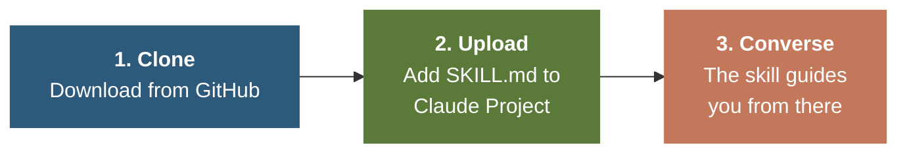
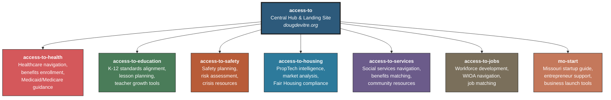
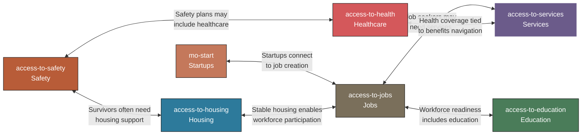
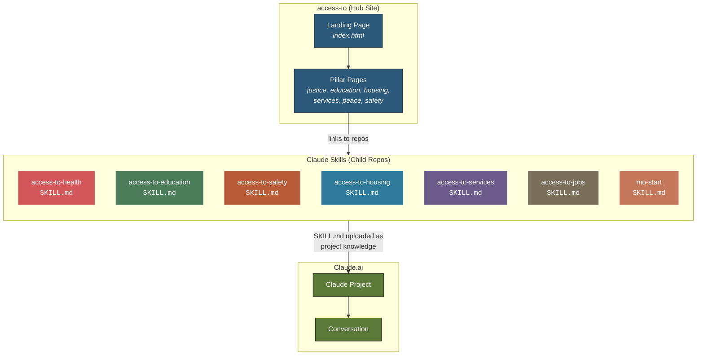
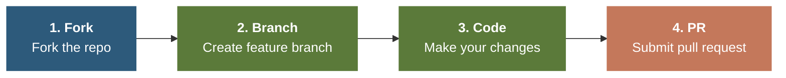
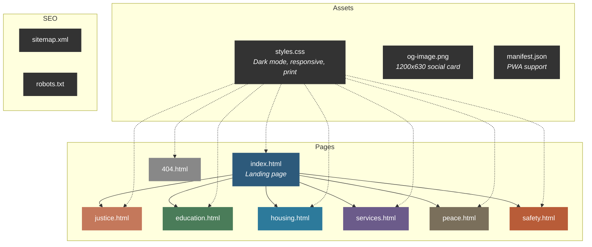

<div align="center">

<!-- HERO BANNER -->
<picture>
  <source media="(prefers-color-scheme: dark)" srcset="https://capsule-render.vercel.app/api?type=waving&color=0:1A1A1A,50:2D5A7B,100:5B7A3A&height=220&section=header&text=Access%20To&fontSize=48&fontColor=FAFAF7&fontAlignY=36&desc=Open-source%20AI%20tools%20closing%20the%20access%20gaps%20that%20matter%20most&descSize=16&descAlignY=56&descColor=CCCCCC&animation=fadeIn">
  
</picture>

[](https://opensource.org/licenses/MIT)
[](https://dougdevitre.org/)
[](https://dougdevitre.org/#pillars)
[](https://dougdevitre.org/#pillars)

**A growing collection of open-source projects organized around six pillars of human access — built for practitioners, advocates, and the people they serve.**

[**View the Live Site**](https://dougdevitre.org/) | [**Browse Projects**](https://dougdevitre.org/#pillars) | [**How It Works**](https://dougdevitre.org/#how-it-works)

</div>

---

## Table of Contents

- [Quick Start](#quick-start)
- [Who Is This For?](#who-is-this-for)
- [Ecosystem Overview](#ecosystem-overview)
- [The Six Pillars](#the-six-pillars)
- [Project Directory](#project-directory)
- [Cross-Project Relationships](#cross-project-relationships)
- [Data Flow Architecture](#data-flow-architecture)
- [FAQ](#faq)
- [Impact at a Glance](#impact-at-a-glance)
- [Contributing](#contributing)
- [Site Architecture](#site-architecture)
- [Support](#support)
- [Contact](#contact)

---

## Quick Start

These projects are **Claude Skills** — structured AI prompt systems that run inside [Claude.ai](https://claude.ai). No coding required.



```bash
# 1. Clone any project
git clone https://github.com/dougdevitre/access-to-health.git
# or: access-to-education, access-to-safety, access-to-housing,
#     access-to-services, access-to-jobs, mo-start

# 2. Open Claude.ai -> Create a Project -> Upload SKILL.md as project knowledge

# 3. Start a conversation — the skill guides you from there
```

Each skill's `SKILL.md` file teaches Claude a specialized workflow — from navigating healthcare benefits to matching job seekers with WIOA programs across all 114 Missouri counties.

---

## Who Is This For?

| If you are a... | You might start with... |
|:----------------|:------------------------|
| **Social worker or caseworker** | [access-to-services](https://github.com/dougdevitre/access-to-services) — navigate benefits, programs, and community resources for clients |
| **Educator or curriculum designer** | [access-to-education](https://github.com/dougdevitre/access-to-education) — align lessons to Missouri K-12 standards with AI-powered planning |
| **Domestic violence advocate** | [access-to-safety](https://github.com/dougdevitre/access-to-safety) — safety planning, risk assessment, and crisis resource navigation |
| **Real estate professional** | [access-to-housing](https://github.com/dougdevitre/access-to-housing) — PropTech intelligence with Fair Housing compliance built in |
| **Workforce development staff** | [access-to-jobs](https://github.com/dougdevitre/access-to-jobs) — WIOA navigation and job matching across Missouri |
| **Healthcare navigator** | [access-to-health](https://github.com/dougdevitre/access-to-health) — Medicaid/Medicare guidance and benefits enrollment support |
| **Aspiring entrepreneur** | [mo-start](https://github.com/dougdevitre/mo-start) — Missouri startup guide with business launch tools |

---

## Ecosystem Overview

`access-to` is the central hub that connects a family of purpose-built AI tools. Each child repository is a standalone Claude Skill targeting a specific domain of human access.



---

## The Six Pillars

<table>
<tr>
<td align="center" width="16%">
<br>
<strong>Health</strong><br>
<sub>Healthcare navigation,<br>benefits, Medicaid</sub><br><br>
<a href="https://github.com/dougdevitre/access-to-health"></a>
</td>
<td align="center" width="16%">
<br>
<strong>Education</strong><br>
<sub>K-12 standards, lesson<br>planning, teacher growth</sub><br><br>
<a href="https://github.com/dougdevitre/access-to-education"></a>
</td>
<td align="center" width="16%">
<br>
<strong>Safety</strong><br>
<sub>Safety planning, risk<br>assessment, crisis resources</sub><br><br>
<a href="https://github.com/dougdevitre/access-to-safety"></a>
</td>
<td align="center" width="16%">
<br>
<strong>Housing</strong><br>
<sub>PropTech intelligence,<br>Fair Housing-safe</sub><br><br>
<a href="https://github.com/dougdevitre/access-to-housing"></a>
</td>
<td align="center" width="16%">
<br>
<strong>Services</strong><br>
<sub>Social services,<br>benefits matching</sub><br><br>
<a href="https://github.com/dougdevitre/access-to-services"></a>
</td>
<td align="center" width="16%">
<br>
<strong>Jobs</strong><br>
<sub>Workforce dev, WIOA,<br>job matching</sub><br><br>
<a href="https://github.com/dougdevitre/access-to-jobs"></a><br>
<a href="https://github.com/dougdevitre/mo-start"></a>
</td>
</tr>
</table>

---

## Project Directory

| Repository | Pillar | Scope | Description | Status |
|:-----------|:-------|:------|:------------|:-------|
| [access-to-health](https://github.com/dougdevitre/access-to-health) | Health | Nationwide | Healthcare navigation, benefits enrollment, Medicaid/Medicare guidance |  |
| [access-to-education](https://github.com/dougdevitre/access-to-education) | Education | Missouri K-12 | Standards alignment, lesson planning, teacher growth tools |  |
| [access-to-safety](https://github.com/dougdevitre/access-to-safety) | Safety | Nationwide | Safety planning, risk assessment, crisis resources, protection orders |  |
| [access-to-housing](https://github.com/dougdevitre/access-to-housing) | Housing | Nationwide | PropTech intelligence, market analysis, Fair Housing compliance |  |
| [access-to-services](https://github.com/dougdevitre/access-to-services) | Services | Nationwide | Social services navigation, benefits matching, community resources |  |
| [access-to-jobs](https://github.com/dougdevitre/access-to-jobs) | Jobs | Missouri | Workforce development, WIOA navigation, job matching across 114 counties |  |
| [mo-start](https://github.com/dougdevitre/mo-start) | Jobs | Missouri | Startup guide, entrepreneur support, business launch tools |  |

---

## Cross-Project Relationships

The child projects are independent but complementary. A person navigating one access gap often faces others simultaneously.



---

## Data Flow Architecture

Each child project follows the same pattern: a `SKILL.md` file teaches Claude a specialized workflow. The hub site serves as the discovery layer.



---

## FAQ

<details>
<summary><strong>Do I need to know how to code?</strong></summary>
<br>
No. These are Claude Skills — structured prompts that run inside <a href="https://claude.ai">Claude.ai</a>. You clone a repo, upload the <code>SKILL.md</code> file to a Claude Project, and start a conversation. No programming required.
</details>

<details>
<summary><strong>What is a Claude Skill?</strong></summary>
<br>
A Claude Skill is a <code>SKILL.md</code> file that teaches Claude a specialized workflow. It acts as project knowledge inside a Claude Project, guiding Claude to follow domain-specific steps — like generating court-ready documents or navigating WIOA workforce programs.
</details>

<details>
<summary><strong>Does this cost anything?</strong></summary>
<br>
The tools themselves are free and open source under MIT. You do need a <a href="https://claude.ai">Claude.ai</a> account (free or paid) to use the skills. A paid Claude Pro plan is recommended for longer conversations and higher usage limits.
</details>

<details>
<summary><strong>Which project should I start with?</strong></summary>
<br>
See the <a href="#who-is-this-for">Who Is This For?</a> section above. Pick the project that matches your role or the access gap you're trying to close. Each project is standalone — you don't need to use them all.
</details>

<details>
<summary><strong>Can I use these outside of Missouri?</strong></summary>
<br>
Some projects are Missouri-specific (access-to-education, access-to-jobs, mo-start) because they reference state standards, WIOA regions, or Missouri county data. Others (access-to-health, access-to-safety, access-to-housing, access-to-services) are designed for nationwide use. Check the Scope column in the <a href="#project-directory">Project Directory</a>.
</details>

<details>
<summary><strong>How do the projects relate to each other?</strong></summary>
<br>
They're independent but complementary. A person navigating one access gap often faces others — a domestic violence survivor may need safety planning, housing support, and healthcare navigation simultaneously. See the <a href="#cross-project-relationships">Cross-Project Relationships</a> diagram for how they interconnect.
</details>

---

## Impact at a Glance

<div align="center">

| | | | |
|:---:|:---:|:---:|:---:|
| **6** | **7** | **400+** | **114** |
| Pillars | Projects | Modules | MO Counties Served |

</div>

---

## Contributing

Issues, PRs, and feature ideas are welcome.



```bash
git clone https://github.com/dougdevitre/access-to.git
cd access-to
git checkout -b feature/your-idea
# make changes, then...
git push origin feature/your-idea
# open a pull request on GitHub
```

For individual project contributions, see each project repo's own guidelines.

---

## Site Architecture

<details>
<summary>Expand to see the hub site's internal architecture (for contributors)</summary>



### Tech Stack

| Layer | Technology |
|:------|:-----------|
| **Markup** | Semantic HTML5 |
| **Styling** | Vanilla CSS (variables, Grid, Flexbox) |
| **Interactivity** | Vanilla JavaScript (no dependencies) |
| **Fonts** | [DM Serif Display](https://fonts.google.com/specimen/DM+Serif+Display) + [DM Sans](https://fonts.google.com/specimen/DM+Sans) |
| **Badges** | [Shields.io](https://shields.io) |
| **Hosting** | [GitHub Pages](https://pages.github.com) |
| **SEO** | OpenGraph, Twitter Cards, JSON-LD, XML sitemap |

### Features

<table>
<tr>
<td>

**Dark Mode** — system preference detection + manual toggle with localStorage persistence

</td>
<td>

**Responsive** — mobile-first with breakpoints at 500px, 600px, and 700px

</td>
</tr>
<tr>
<td>

**Accessible** — skip-to-content, ARIA labels, keyboard nav, reduced motion support

</td>
<td>

**Fast** — zero JS dependencies, font preloading, lazy-loaded images

</td>
</tr>
<tr>
<td>

**Print-Ready** — dedicated print styles for all pages

</td>
<td>

**PWA-Ready** — web app manifest for installable experience

</td>
</tr>
</table>

</details>

---

## Support

<div align="center">

**These tools are free. Building them isn't.**

[](https://venmo.com/dougdevitre)

100% goes to development. No overhead. Receipt on request.

</div>

---

## Contact

<div align="center">

**Doug Devitre** — product builder, speaker, and founder of [CoTrackPro](https://cotrackpro.com)

Based in the St. Louis metro area. Focused on family law technology, workforce development, and civic access tools for Missouri and beyond.

[](https://linkedin.com/in/dougdevitre)
[](https://github.com/dougdevitre)
[](mailto:dougdevitre@gmail.com)

</div>

---

<div align="center">

Open source under [MIT](https://opensource.org/licenses/MIT) unless otherwise noted in individual project repositories.

&copy; 2026 Doug Devitre

<picture>
  <source media="(prefers-color-scheme: dark)" srcset="https://capsule-render.vercel.app/api?type=waving&color=0:1A1A1A,50:2D5A7B,100:5B7A3A&height=100&section=footer">
  
</picture>

</div>
