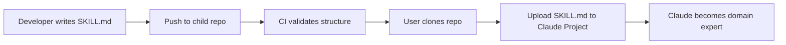
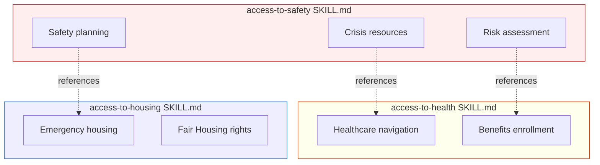
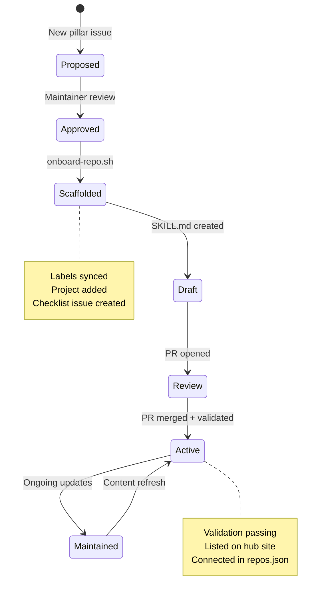

# Skill Development Guide

How to create, maintain, and validate Claude Skills in the Access To ecosystem.

## What is a Claude Skill?

A Claude Skill is a structured markdown file (`SKILL.md`) that provides domain knowledge, workflows, and guardrails to Claude. Users upload it to a Claude Project as a knowledge file — no code required.



## SKILL.md structure

Every SKILL.md should follow this pattern:

```markdown
# Skill Name

One-sentence description of what this skill does.

## Role

Define who Claude becomes when this skill is active.
- Target audience (e.g., social workers, educators, advocates)
- Domain expertise (e.g., Missouri family law, WIOA workforce programs)
- Tone and communication style

## Capabilities

List the specific workflows this skill enables:
1. Workflow name — brief description
2. Workflow name — brief description
3. ...

## Knowledge

Domain-specific facts, rules, regulations, or data that Claude
needs to perform accurately. This is the core content.

### Section A
...

### Section B
...

## Guardrails

What Claude should NOT do:
- Do not provide legal/medical advice (refer to professionals)
- Do not fabricate case law, statutes, or program details
- Always cite sources when referencing regulations
- Escalation criteria (when to recommend professional help)

## Examples

Sample conversations showing the skill in action.
Helps Claude understand expected input/output patterns.
```

## Validation

Child repos validate their SKILL.md using the hub's reusable workflow. Add this to your child repo:

```yaml
# .github/workflows/validate-skill.yml
name: Validate Skill

on:
  push:
    paths: ['SKILL.md']
  pull_request:
    paths: ['SKILL.md']

jobs:
  validate:
    uses: dougdevitre/access-to/.github/workflows/reusable-skill-check.yml@main
    with:
      repo_name: access-to-YOUR-PILLAR
      pillar: YOUR_PILLAR
```

The validator checks:
- File exists and is not empty
- Has markdown headings (structure)
- File size is reasonable (500 bytes – 100 KB)
- Reports metrics in the GitHub Actions summary

## Cross-pillar skills

Some skills reference resources from other pillars. When this happens:

1. Document the dependency in `repos.json` under `connects_to`
2. Add the `cross-repo` label to related issues
3. Reference specific sections, not entire skills — keep skills self-contained



## Best practices

### Content quality
- **Be specific.** "Missouri RSMo 452.375" is better than "state family law"
- **Be current.** Include effective dates for regulations. Note when content was last verified.
- **Be structured.** Use headings, lists, and tables. Claude parses structured content more reliably than prose.
- **Be bounded.** Define what the skill does NOT cover. Explicit guardrails prevent hallucination.

### Size and modularity
- Keep SKILL.md under 100 KB — Claude has context limits
- If a skill grows beyond that, split into modules (`SKILL.md`, `modules/housing-programs.md`, etc.)
- Each module should be self-contained enough to upload independently

### Testing
- Test skills in Claude.ai before merging
- Try edge cases: unusual inputs, out-of-scope requests, adversarial prompts
- Verify that guardrails hold (Claude declines inappropriate requests)
- Check that cited regulations, programs, and resources are accurate

## Onboarding a new skill repo

Use the hub's onboarding script:

```bash
# From the access-to hub repo
.github/scripts/onboard-repo.sh access-to-NEW-PILLAR pillar-name nationwide
```

This will:
1. Sync shared labels to your repo
2. Add it to GitHub Project #1
3. Create a setup checklist issue

Then manually:
1. Add the repo entry to `.github/config/repos.json`
2. Create your `SKILL.md`
3. Add the validation workflow (see above)
4. Create a pillar page on the hub site

## Lifecycle


